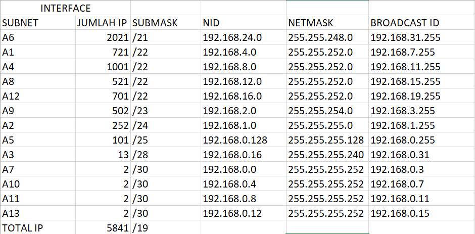
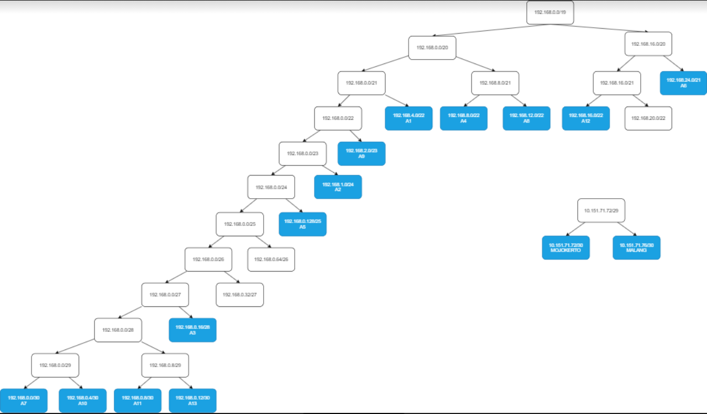
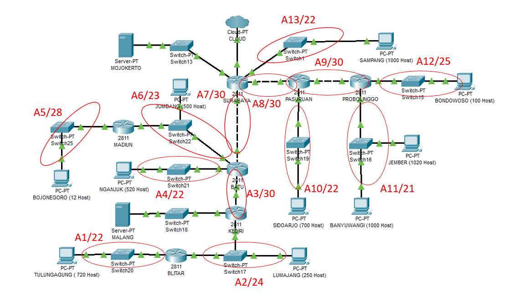
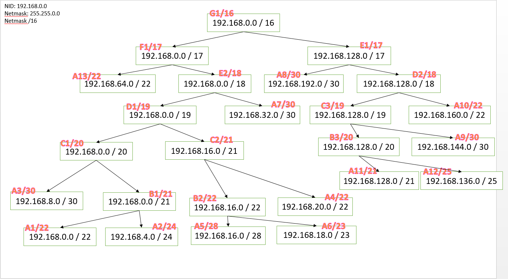
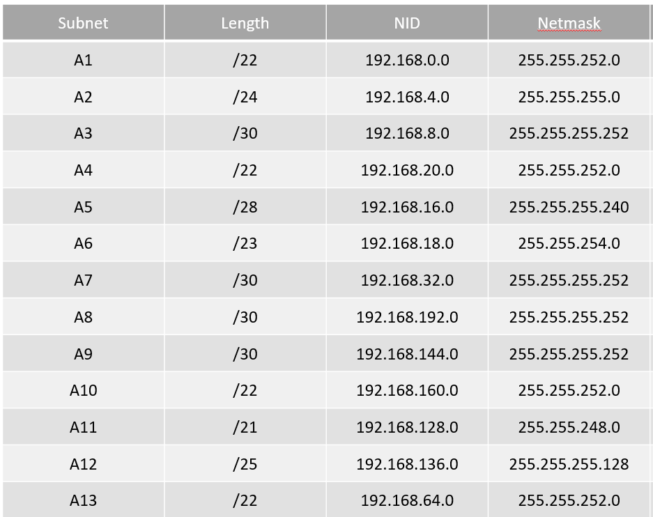

# Jarkom_Modul4_Lapres_E08
### Foto dan bukti kode ada di file yang diupload di github ini
## VSLM
### Subnetting
- Melakukan subnetting hingga menjadi seperti gambar di bawah ini
- 
- Melakukan perhitungan IP
- 
- Membuat pohon
- 

### Implementasi pada CPT
- Membuat topologi di CPT seperti gambar di bawah ini
- 
- Mengatur IP untuk masing-masing interface yang ada di setiap device sesuai dengan pembagian subnet pada pohon VLSM
- Melakukan routing pada setiap router

## CIDR
### Subnetting
- Melakukan subnetting dengan tahap seperti gambar-gambar di bawah ini
- 
- Tahapan lebih lengkap bisa lihat di file ppt
- Menghitung pembagian IP dengan pohon seperti gambar di bawah ini
- 
- 

### Implementasi pada UML
- Membuat topologi.sh
- Mengatur IP untuk masing-masing interface yang ada di setiap device sesuai dengan pembagian subnet pada pohon CIDR
- Menyalakan IPv4 forwarding pada setiap router
- Melakukan routing dengan membuat file route.sh pada router
- Semua syntax ada di file kode (ada link yg mengarah ke file docs)
